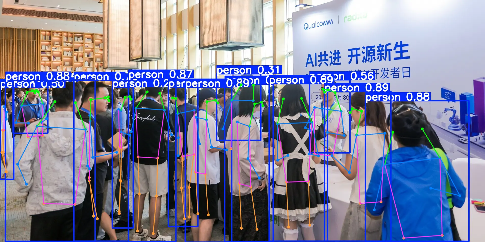

# Yolo26 ModelDeploy


-0B23A9)


⚠️Pre-release Warning⚠️

## 📖 概述

本模块聚焦 YOLO26 的 **目标检测 (Detect)** 和 **姿态估计 (Pose)** 两种任务，提供从 PyTorch 到边缘端 NPU (Rockchip NPU / Qualcomm HTP) 的完整转换与推理流程。

> 同时本项目也是本小姐🍃的项目 [Focus-Finder](https://github.com/YeWenxuan64/Focus-Finder) 的模型部署部分喵~



---

### 🧬 关于 YOLO26

**YOLO26** 是基于 [Ultralytics](https://docs.ultralytics.com/) 框架训练的轻量级视觉模型，支持目标检测、实例分割、姿态估计、旋转框检测、图像分类等多种视觉任务。

本模块聚焦其中两项任务，选用 **YOLO26s**（小模型），在精度与推理速度之间取得良好平衡，专为边缘端 NPU 部署优化：

| 任务 | 说明 | 输出 |
|------|------|------|
| **Detect（目标检测）** | 识别并定位图像中的物体 | 边界框 + 类别（COCO 80 类） |
| **Pose（姿态估计）** | 检测人体关键点 | 边界框 + 17 个关键点坐标 |

---

### ✨ 功能亮点

- **双任务支持** — 目标检测（COCO 80 类）+ 姿态估计（COCO 17 关键点），同一套工具链
- **全链路自动化** — 一条命令完成 `.pt` → ONNX → RKNN / QNN，可调参数集中在脚本顶部配置区，无需手动编辑 yaml
- **双平台部署** — Rockchip NPU（RK3588/RK3576）+ Qualcomm HTP（QCS6490），INT8 量化
- **PyTorch 层直出部署图** — `YOLO26RawExport` 直接调用 one2one 各尺度分支，Sigmoid 在 PyTorch 侧完成，导出图天然呈 Conv+Sigmoid 相邻，便于 NPU 工具链融合
- **onnxslim 瘦身** — 自动移除冗余算子、折叠常量，减小模型体积
- **输出顺序自适应** — `identify_output_order()` 按张量尺寸自动匹配模型输出，兼容不同推理后端
- **Anchor-based 解码** — `build_anchor_grids()` 预计算三检测头锚点网格，高效还原边界框
- **内置实时演示** — 开箱即用的视频流推理 + `timeit` FPS 统计，按 `q` 退出
- **易于集成** — 提供 Python API 接口，三行代码即可嵌入自有项目

---

**上游项目：** 
- [ultralytics/ultralytics](https://github.com/ultralytics/ultralytics) — Ultralytics YOLO 官方框架
- [Edge_ModelDeploy](https://github.com/YeWenxuan64/Edge_ModelDeploy) — 模型转换工具链


**本子模块：**`yolo26_ModelDeploy` 聚焦 YOLO26 系列模型（Detect + Pose）的完整部署链路：

| 阶段 | 说明 | 脚本 |
|------|------|------|
| **PyTorch → ONNX** | PyTorch 层直出各尺度原始分支图（Conv+Sigmoid 相邻）+ onnxslim 瘦身 | [`Yolo26_pytorch2onnx.py`](./Yolo26_pytorch2onnx.py) |
| **ONNX → RKNN** | 使用父项目 `utilities/onnx_to_rknn.py`，INT8 量化 + FlashAttention 优化，部署至 Rockchip NPU | [`Yolo26_onnx2rknn.py`](./Yolo26_onnx2rknn.py) |
| **ONNX → QNN** | 使用父项目 `utilities/onnx_to_qnn.py`，INT8 量化（SQNR + Entropy），部署至 Qualcomm HTP | [`Yolo26_onnx2qnn.py`](./Yolo26_onnx2qnn.py) |
| **推理** | 加载 ONNX / RKNN / QNN 模型，实时检测 + 可视化 | [`yolo26_main.py`](./yolo26_main.py) / [`yolo26_pose_main.py`](./yolo26_pose_main.py) |


## 🏗️ 项目结构

```
Edge_ModelDeploy/                   # 父项目根目录
├── datasets/                        # 量化校准数据集
├── utilities/                       # 父项目工具链
├── README.md                        # 父项目 README
├── README_TOOLUSE.md
├── requirements.txt                 # 父项目 Python 依赖
├── LICENSE
├── ...
└── yolo26_ModelDeploy/              # 本模块根目录
    ├── Yolo26_pytorch2onnx.py       # PyTorch → ONNX 导出 + 优化
    ├── Yolo26_onnx2rknn.py          # ONNX → RKNN（使用父项目 utilities/onnx_to_rknn.py）
    ├── Yolo26_onnx2qnn.py           # ONNX → QNN（使用父项目 utilities/onnx_to_qnn.py）
    ├── yolo26_main.py               # 目标检测推理 + 可视化
    ├── yolo26_pose_main.py          # 姿态估计推理 + 可视化
    ├── yolo26_pytorch_test.py       # PyTorch 模型快速验证
    ├── models_convert/
    │   ├── original/
    │   │   ├── ... .pt              # PyTorch 权重（会在转换时由 ultralytics 自动下载）
    │   │   └── ultralytics/         # ultralytics/ultralytics submodule
    │   ├── onnx/
    │   │   └── ...                  # 导出后的 ONNX
    │   ├── rknn/
    │   │   └── ...                  # RKNN 模型
    │   └── qnn/
    │       └── ...                  # QNN 模型
    ├── README.md
    └── LICENSE
```


## 📦 部署流程

本模块是 [Edge_ModelDeploy](https://github.com/YeWenxuan64/Edge_ModelDeploy) 的子模块，**必须先部署父项目**。

### 1. 克隆父项目
```bash
git clone https://github.com/YeWenxuan64/Edge_ModelDeploy.git
cd Edge_ModelDeploy
```

### 1.1 安装依赖
按照父项目 [Edge_ModelDeploy README.md](../README.md) 的指示，进行**依赖安装与量化校准数据集的准备**

### 2. 递归克隆本模块

```bash
git clone --recurse-submodules https://github.com/YeWenxuan64/yolo26_ModelDeploy.git
```

> 会递归克隆 `ultralytics` 子模块（位于 `yolo26_ModelDeploy/models_convert/original/ultralytics`）<br>
> 如果 submodule 未拉取，可手动拉取：
> ```bash
> cd yolo26_ModelDeploy
> git submodule update --init --recursive
> ```
> 或查看 [models_convert/original/README.md](./models_convert/original/README.md)


## 🔄 模型转换

转换流程：**`.pt` → ONNX（导出 + 优化） → RKNN / QNN**

所有转换脚本支持 `--yolo_type` 参数切换模型类型：

| 参数值 | 模型 | 检测内容 |
|--------|------|----------|
| `yolo` | yolo26s | 目标检测（COCO 80 类） |
| `yolo-pose` | yolo26s-pose | 姿态估计（COCO 17 关键点） |

### 步骤 1: PyTorch → ONNX

```bash
cd yolo26_ModelDeploy
python Yolo26_pytorch2onnx.py --yolo_type yolo
# or python Yolo26_pytorch2onnx.py --yolo_type yolo-pose
```

**可修改的参数** — 编辑 `Yolo26_pytorch2onnx.py` 顶部「导出参数」配置区：

| 参数 | 默认值 | 说明 |
|------|--------|------|
| `IMG_SIZE` | `[320, 640]` | 输入图像尺寸 `[H, W]`，需为 32 的倍数 |
| `BATCH` | `1` | 批次大小 |
| `ONNX_OPSET` | `13` | ONNX opset 版本 |

**导出流程** — `export_raw()` + `simplify()` 自动完成以下步骤：
1. **模型准备** — 沿用官方 export 前置：`fuse()` 融合 Conv+BN 并删除 one2many 分支，C2f/C3k2 改用 `forward_split`
2. **PyTorch 层直出** — head 临时替换为 `Identity` 取得 `[P3, P4, P5]`，手动调用各尺度 one2one 分支，cls 分支的 Sigmoid 在 PyTorch 侧完成
3. **onnxslim 瘦身** — 精简算子、折叠常量，再做 shape inference 与 `check_model(full_check=True)`

输出：`models_convert/onnx/yolo26s_[1,3,320,640].onnx`（detect 6 个输出 `box_p3~p5` / `cls_p3~p5`，pose 额外 `kpts_p3~p5`，顺序固定为 box → cls → kpts）


### 步骤 2.1: ONNX → RKNN

```bash
python Yolo26_onnx2rknn.py --yolo_type yolo
# or python Yolo26_onnx2rknn.py --yolo_type yolo-pose
```

输出：`models_convert/rknn/yolo26s_i8[1,320,640,3].rknn`

> RKNN 转换启用了 `set_quantization_method(flash_attention=True)` 以优化 Attention 计算。

**可配置参数**：修改脚本中 `OnnxToRKNN` 对象方法的参数<br>
详见父项目 [Edge_ModelDeploy README_TOOLUSE.md](https://github.com/YeWenxuan64/Edge_ModelDeploy/blob/main/README_TOOLUSE.md)


### 步骤 2.2: ONNX → QNN

```bash
python Yolo26_onnx2qnn.py --yolo_type yolo
# or python Yolo26_onnx2qnn.py --yolo_type yolo-pose
```

输出：`models_convert/qnn/yolo26s_i8[1,320,640,3].bin`

> QNN 量化策略：`param_quant_method='sqnr'`（参数量化）+ `act_quant_method='entropy'`（激活量化）。

**可配置参数**：修改脚本中 `OnnxToQNN` 对象方法的参数<br>
详见父项目 [Edge_ModelDeploy README_TOOLUSE.md](https://github.com/YeWenxuan64/Edge_ModelDeploy/blob/main/README_TOOLUSE.md)

## 🧠 推理

推理后端依赖 [Edge_Inferencer](https://github.com/YeWenxuan64/Edge_Inferencer) 模块，支持 ONNX Runtime 和 NPU 推理切换。<br>
推理后端的部署与使用，详见 [Edge_Inferencer README.md](https://github.com/YeWenxuan64/Edge_Inferencer/blob/main/README.md)

两个推理入口，分别对应 Detect 和 Pose 任务。内置实时视频流演示，按 `q` 退出

### 🎯 目标检测

```bash
python yolo26_main.py
```

**类：** `Yolo26`

**`__init__` 参数：**

| 参数 | 类型 | 默认值 | 说明 |
|------|------|--------|------|
| `model_path` | `str` | — | 模型文件路径 |
| `model_size` | `tuple` | `(640, 320)` | 模型输入尺寸 `(width, height)` |
| `need_preprocess` | `bool` | `False` | 是否对输入做 `/255` 归一化 |
| `conf_thresh` | `float` | `0.25` | 置信度阈值 |
| `cores` | `tuple` | `(0,)` | NPU 绑核或并发数，如 `(0,1,2)` |
| `mult_task` | `bool` | `False` | 是否启用多任务并发推理 |

**`detect()` 方法：**

| 参数 | 类型 | 默认值 | 说明 |
|------|------|--------|------|
| `color_image` | `np.ndarray` | — | 输入 RGB 图像 `(H, W, 3)` |
| `block` | `bool` | `True` | 是否阻塞等待推理结果 |
| `scale` | `tuple` | `(1.0, 1.0)` | 缩放比例，用于坐标还原 |
| `offset` | `tuple` | `(0, 0)` | 偏移量 `(x, y)`，用于坐标还原 |

**返回值：** `np.ndarray (N, 6)` → `[[x1, y1, x2, y2, class_id, score]...]` 或 `None`

**`release()` 方法：** 释放 NPU 资源

- **可视化：** `draw_yolo()`，绘制边界框 + 类别标签 + 置信度
- **预处理：** `resize_image()` 等比缩放 + 居中 padding（黑色填充）
- **后处理：** Anchor-based 解码 `bbox_anchor()` + `identify_output_order()` 输出顺序自适应


### 🦴 姿态估计

```bash
python yolo26_pose_main.py
```

**类：** `Yolo26Pose`

**`__init__` 参数：**

同 `Yolo26` 类

**`detect()` 方法：**

参数同 `Yolo26` 类

**返回值：** `np.ndarray (N, 57)` → `[[x1, y1, x2, y2, class_id, score, kpt_x, kpt_y, kpt_conf, ...]...]` 或 `None`

> 返回的 57 个值 = 6（bbox+class+score）+ 51（17 关键点 × 3 值 x/y/conf）

**`release()` 方法：** 释放 NPU 资源

- **可视化：** `draw_yolo_pose()`，绘制边界框 + 17 关键点圆圈 + 19 条骨骼连线
- **预处理：** `resize_image()` 等比缩放 + 居中 padding（黑色填充）
- **后处理：** Anchor-based 解码 `bbox_anchor()` + `kpts_anchor()` + `identify_output_order()` 输出顺序自适应


### 🔗 尝试集成到自己的项目

```python
from yolo26_main import Yolo26, draw_yolo, resize_image
# 或
# from yolo26_pose_main import Yolo26Pose, draw_yolo_pose, resize_image

# 初始化
model = Yolo26(model_path='path/to/model.onnx', conf_thresh=0.25, need_preprocess=True, cores=(0,))

# 预处理
rgb = cv2.cvtColor(frame, cv2.COLOR_BGR2RGB)
resized, scale, offset = resize_image(rgb, (640, 320))

# 推理
result = model.detect(resized, scale=(scale, scale), offset=offset)

# 可视化
if result is not None:
    frame = draw_yolo(frame, result)
```


### 🧪 PyTorch 模型快速验证

```bash
python yolo26_pytorch_test.py
```

使用原始 `.pt` 权重在视频流上运行推理，用于快速验证模型效果。

---

### ⚡ 性能数据

[性能测试说明](https://github.com/YeWenxuan64/Edge_Inferencer/blob/main/PERFORMANCE.md)

| 平台 | 芯片 | 模型 | 精度 | 输入尺寸 (H×W) | 推理时间(ms) | 后处理时间(ms) | 并发推理时间(ms) |
|------|------|------|------|----------------|----------|------------|------|
| Rockchip NPU | RK3588 | yolo26s | INT8 | 320×640 | 19.40 | 2.09 | 12.21@2tasks<br>6.87@3tasks |
| Rockchip NPU | RK3588 | yolo26s-pose | INT8 | 320×640 | 20.49 | 2.07 | 11.55@2task<br>6.43@3tasks |
| Qualcomm HTP | QCS6490 | yolo26s | INT8 | 320×640 | 11.29 | 1.49 | 7.78@2tasks<br>5.17@3tasks |
| Qualcomm HTP | QCS6490 | yolo26s-pose | INT8 | 320×640 | 11.14 | 1.30 | 6.74@2tasks<br>4.53@3tasks |


---

### 🔧 为什么部署 YOLO26 需要魔改？

NPU 对部分算子的计算支持有限（如数据搬运类算子，取模算子），直接导出原生 YOLO26 模型会导致推理性能下降甚至失败。本项目对模型做了以下适配（**不影响最终输出结果，无需重新训练**）：

| 改动 | 原因 | 方案 |
|------|------|------|
| **移除后处理结构** | 模型内置的后处理（坐标解码）涉及动态形状和控制流，NPU 无法高效执行 | 全部剥离至 CPU 侧，NPU 只跑纯推理部分 |


---


## 📄 License

[MIT License](./LICENSE) — Copyright (c) 2026 叶文轩

各子模块的模型、代码，以及数据集遵循其原始 License。<br>
ultralytics/ultralytics仓库的许可证：
[AGPL-3.0](https://github.com/ultralytics/ultralytics/blob/main/LICENSE)
